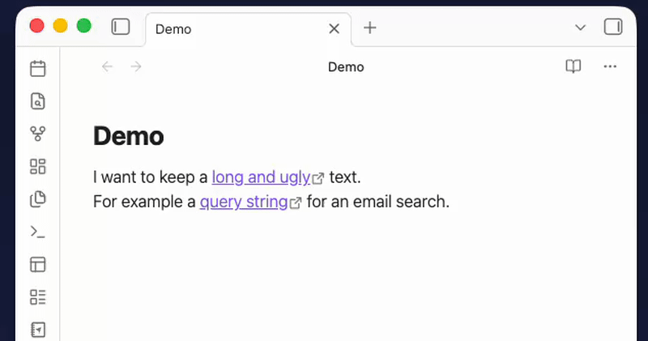

# Copy Text Protocol



## What is this for?

Have you ever wanted to create a note that, when you click a link, **automatically copies a snippet of text to your clipboard**? This plugin makes that possible.

Some use cases:

- A "cheat sheet" note with commands, passwords, or templates — click the link, paste anywhere.
- A collection of code snippets ready to paste into a terminal.
- Frequently used texts (email signatures, boilerplate, addresses) accessible from any note.
- Query strings to paste into other apps (e.g. to search specific emails in Outlook, my primary use case)

## How it works

The plugin registers a custom `obsidian://copy` protocol. When you click a link using this protocol, the text embedded in the URL is silently copied to your clipboard and a small confirmation notice appears — no popups, no external apps.

## Creating links manually

```markdown
[Click to copy](obsidian://copy?text=Your-text-here)
```

When clicked, **"Your-text-here"** is copied to your clipboard.

For text containing spaces, wrap the URL in angle brackets:

```markdown
[Click to copy](<obsidian://copy?text=Hello world>)
```

Other special characters need to be encoded, and as you can see it can be tedious to do manually, so a command for that is included.

## Creating links with a keyboard shortcut

The plugin includes a command called **Copy Protocol: Paste clipboard as copy-protocol link** that automates the process. It reads your current clipboard content and inserts a ready-to-use markdown link at the cursor. If you have text selected in the editor, that selection becomes the link label; otherwise, the clipboard text itself is used as a label.

### To assign a keyboard shortcut

1. Open **Settings → Hotkeys**.
2. Search for "Paste clipboard as copy-protocol link".
3. Click the `+` button and press your preferred key combination.

### Example workflow

1. Copy a command or text you want to reuse (e.g. `git log --oneline`).
2. In your note, type a label like `Show git log` and select it.
3. Press your hotkey.
4. The selection is replaced with:
   ```
   [Show git log](<obsidian://copy?text=git%20log%20--oneline>)
   ```
5. Clicking that link copies `git log --oneline` to your clipboard instantly.

## Hover Previews

You can preview the text that a copy link contains before actually copying it.

- **To preview**: Hold `Ctrl` (or `Cmd` on macOS) while hovering your mouse over any `obsidian://copy` link or copy icon.
- A custom, theme-aware tooltip will appear showing a snippet of the text to be copied (e.g., `Copy: "your command here"`).
- This allows you to verify exactly what is going to be copied without needing to click it or inspect the markdown source.

## Installation

You can install this plugin from the Community Plugins settings of Obsidian, or via [BRAT](https://github.com/TfTHacker/obsidian42-brat):

1. Open the BRAT settings in Obsidian.
2. Click **Add Beta plugin**.
3. Paste the repository URL: `jldiaz/copy-protocol-plugin`.
4. Enable the plugin in your Community Plugins list.
